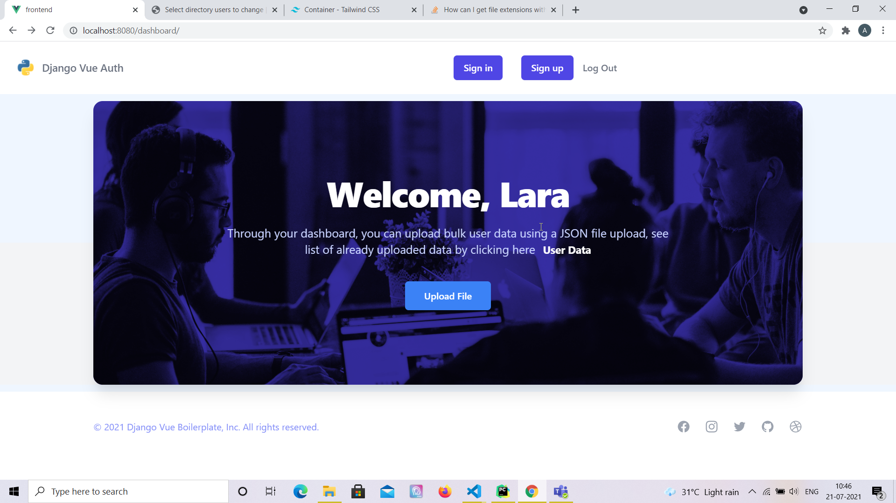

# Django Vue Auth Boilerplate

## Project Briefing

This is a simple boilerplate to get you started with full stack applications using Vue and Django, Postgresql is used as database and tailwind css is used for UI components.

Tailwind component design is inspired from the website 
https://tailwindcomponents.com/

## Built With

* [Django](https://www.djangoproject.com/)
* [Vue JS](https://vuejs.org/)
* [Postgresql](https://www.postgresql.org/)
* [Tailwind CSS](https://tailwindcss.com/)

## Authors

* **Amit Prafulla (APFirebolt)** - (http://apgiiit.com/)

## Project setup

This project requires Postgresql to be installed on your system. As best practice you can create a new virtual environment and install the required packages from the 'requirements.txt' file.

On the frontend side of things go inside the frontend folder and run npm install, this would install vue and all the required libraries including Tailwind CSS.
```
npm install
npm run serve
```

For Django Backend, setup the database and run migrations. Finally, run the server using the manage command. 

```
python manage.py makemigrations
python manage.py migrate
python manage.py runserver
```

## Updates 

- 24/3/23

Front-end is no longer compatible with the latest version of Node which is 18 at the time of updating this project. Use NVM and LTS version of Node 14 for running this project. Might consider conversion to Vite in future.

## Project Screenshots

Please find some of the screenshots of the application. Below is the screenshot of the Register page.


This shows login page.


The main dashboard page.



This shows page where data read from file uploaded would be displayed.


## Serve Vue build with Django

Following static file settings are used through which Django would serve the index.html generated during build process.

```
python manage.py collectstatic
```

These are the settings used in Django settings file

```
TEMPLATES = [
    {
        'BACKEND': 'django.template.backends.django.DjangoTemplates',
        'DIRS': [BASE_DIR / 'client/dist']
        ,
        'APP_DIRS': True,
        'OPTIONS': {
            'context_processors': [
                'django.template.context_processors.debug',
                'django.template.context_processors.request',
                'django.contrib.auth.context_processors.auth',
                'django.contrib.messages.context_processors.messages',
            ],
        },
    },
]

STATIC_URL = '/static/'
MEDIA_URL = '/images/'

STATICFILES_DIRS = [
    BASE_DIR / 'static',
    BASE_DIR / 'client/dist/assets'
]

MEDIA_ROOT = BASE_DIR / 'static/images'
STATIC_ROOT = BASE_DIR / 'staticfiles'

CORS_ALLOW_ALL_ORIGINS = True
```

Notice that we have changed the templates folder to direct dist folder inside the client app.